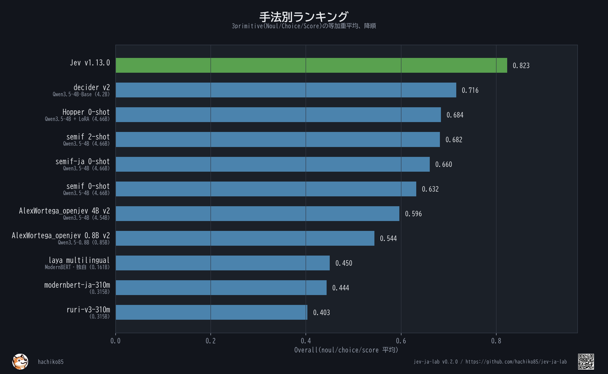
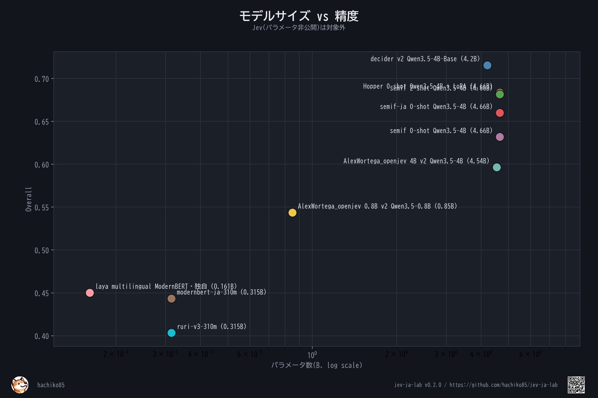
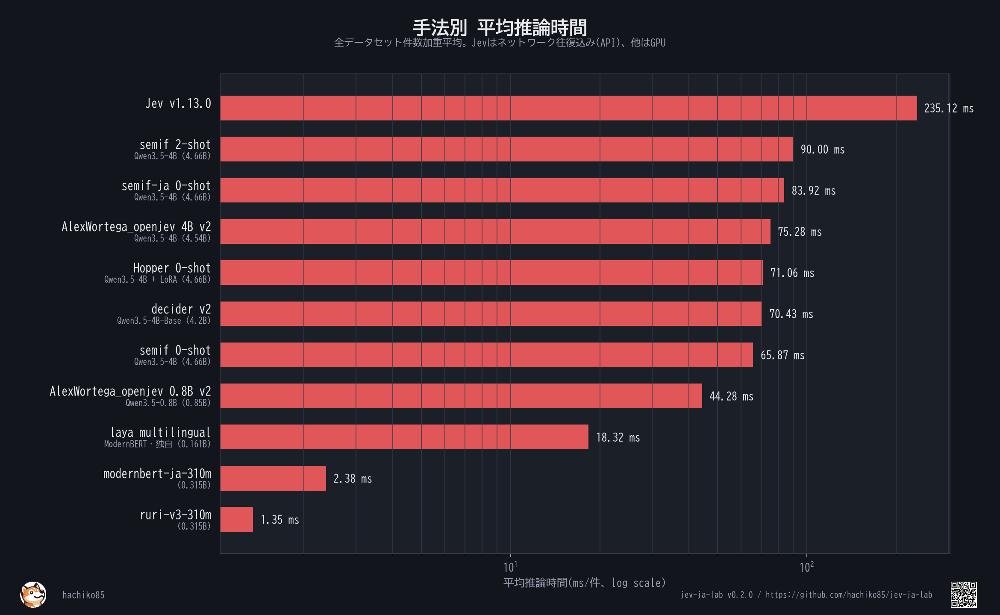
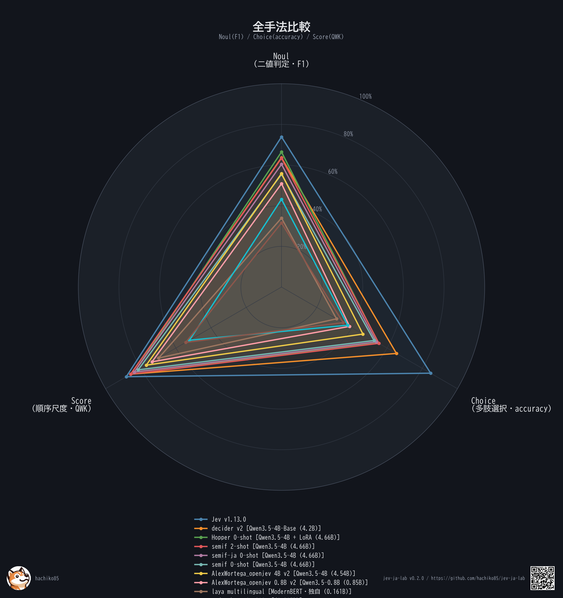
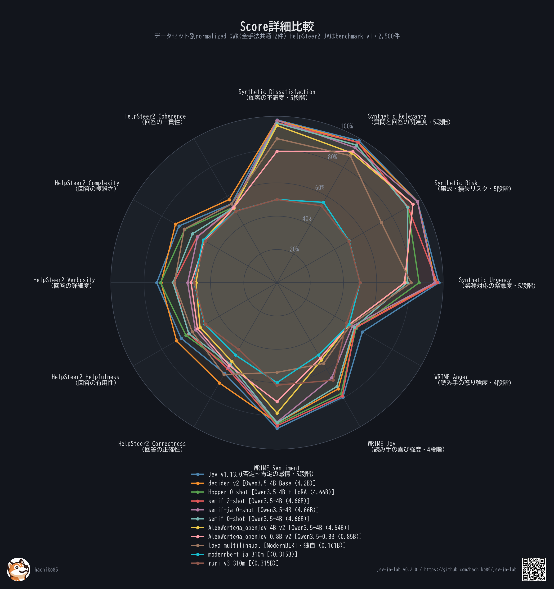

# jev-ja-lab

日本語データセットをJevの3 Primitiveへ変換し、ローカルまたはHugging Face Hub上の判断モデルを同一条件で比較する評価基盤です。

- `Noul`: Yes / No の二値判断
- `Choice`: 複数候補から1つを選択
- `Score`: 順序付き尺度のスコアリング

現フェーズは評価基盤です。モデル学習機能は含みません。

## ドキュメント

- 評価設定・YAML・実行方法: `how_to_use.md`
- 別PCへのZIP移行: `MIGRATION.md`
- Primitive設計: `EVALUATION_PRIMITIVES.md`
- 今回の実行条件と結果: `EVAL_JEV_20260918.md`
- 実行設定: `configs/eval/primitives.20260918.yaml`

## 必要環境

- Python 3.11以上
- NVIDIA GPUを使う場合: 対応ドライバとCUDA対応PyTorch
- Hubモデル・データセットを取得する場合: インターネット接続
- gatedリポジトリを使う場合: 配布元での利用規約同意と `HF_TOKEN`

## 最短セットアップ

### uv

```bash
uv sync --extra eval --extra viz --extra orchestrate --extra dev
uv run pytest
```

### Python仮想環境

Linux/macOS:

```bash
python -m venv .venv
source .venv/bin/activate
python -m pip install -U pip
pip install -e ".[eval,viz,orchestrate,dev]"
pytest
```

Windows PowerShell:

```powershell
py -3.11 -m venv .venv
.venv\Scripts\Activate.ps1
python -m pip install -U pip
pip install -e ".[eval,viz,orchestrate,dev]"
pytest
```

## 最短実行

GPU不要の動作確認:

```bash
uv run jev-ja-lab-eval --dataset mmmlu_ja --scorer mock --limit 5
```

YAML全体のsmoke評価:

```bash
uv run jev-ja-lab-eval-workflow \
  --config configs/eval/primitives.20260918.yaml \
  --phase smoke
```

本番評価:

```bash
uv run jev-ja-lab-eval-workflow \
  --config configs/eval/primitives.20260918.yaml \
  --phase production
```

`pip install -e ...` を使った環境では、先頭の `uv run` を外して実行できます。

## 標準評価プロファイル

標準設定は、全モデルを短時間で比較する30軸プロファイルです。

| Primitive | 軸数 | 1モデル当たり評価数 |
|---|---:|---:|
| Noul | 14 | 25,908 |
| Choice | 9 | 28,676 |
| Score | 7 | 8,300 |
| 合計 | 30 | 62,884 |

LLM-jp Toxicity属性別、Civil Comments全件、JSFactCheckBenchの定義とadapterも実装済みです。標準実行では処理時間または認証要件を理由に無効化しています。`tasks.<primitive>.datasets` へIDを戻すと追加評価できます。

## データセットの取得(openjev-ja-evalルーター)

評価データは、Hugging Face Hubの`hachiko85/openjev-ja-eval`を経由して取得します。このリポジトリは
サードパーティのデータを再配布せず、各データセットの配布元・revision・split・ライセンスを記した
`manifest.json`(コピー: `datasets_router/manifest.json`)と取得クライアントだけを持つルーターで、
取得時に各配布元(Hugging Face Hub / GitHub)から直接ダウンロードします。独自データ
(`synthetic_score`、抽出したHelpSteer2-JA benchmark-v1)のみ同リポジトリ内で管理します。

```bash
# サブセット: noul / choice / score / all(split=test)
uv run jev-ja-lab-datasets list --subset all
uv run jev-ja-lab-datasets fetch --subset all --datasets-root ./datasets
```

再配布禁止・要承認のデータ(JGPQA)はルーター対象外で、`--include-gated`と自分のHFトークンで
のみ取得を試みます。データセット名・詳細・リンク・使用split・ライセンスの一覧は
[`datasets_router/README.md`](datasets_router/README.md)(Hub上のカードと同じ)を参照してください。
ルーターの更新は`scripts/publish_dataset_router.py`(`--dry-run`で差分確認)で行います。

## 評価結果(手法比較、2026-09-26時点)

同一の判断タスク(Noul/Choice/Score、全30データセット共通)を、判定原理が異なる11手法
(TypeSafe Jev API、decider-4b v2、Hopper、semif系3種、AlexWortega_openjev系2種、laya、embedding、素のBERT直接評価)
で横断比較した結果です。詳細(primitive別内訳・データセット別レーダー・全生データ)は
`results/eval-summary/README.md`参照。

| 手法 | Overall | HelpSteer2 | ベースモデル | パラメータ数 | 推論時間(ms/件) |
|---|---:|---:|---|---:|---:|
| **Jev v1.13.0** | **0.823** | 0.650 | TypeSafe Jev API | 非公開 | 235.12 |
| decider v2 | 0.716 | 0.674 | Qwen3.5-4B-Base(Mapika/decider-4b v2) | 4.2B | 70.43 |
| Hopper 0-shot | 0.684 | 0.616 | Qwen3.5-4B + LoRA(HopitAI/hopper) | 4.66B | 71.06 |
| semif 2-shot | 0.682 | 0.581 | Qwen3.5-4B | 4.66B | 90.00 |
| semif-ja 0-shot | 0.660 | 0.554 | Qwen3.5-4B | 4.66B | 83.92 |
| semif 0-shot | 0.632 | 0.582 | Qwen3.5-4B | 4.66B | 65.87 |
| AlexWortega_openjev 4B v2 | 0.596 | 0.520 | Qwen3.5-4B(qwen3.5-4b-nli-v2) | 4.54B | 75.28 |
| AlexWortega_openjev 0.8B v2 | 0.544 | 0.533 | Qwen3.5-0.8B(qwen3.5-0.8b-nli-v2s-long) | 0.85B | 44.28 |
| laya multilingual | 0.450 | 0.607 | ModernBERT・独自(22層/768隠れ層) | 0.161B | 18.32 |
| modernbert-ja-310m | 0.444 | 0.503 | (直接評価) | 0.315B | 2.38 |
| ruri-v3-310m | 0.403 | 0.491 | (embedding、最良) | 0.315B | 1.35 |

HelpSteer2列は追加のScore指標(HelpSteer2-JA benchmark-v1・2,500件×5軸の正規化QWK平均、
0.5が一致なし水準)で、Overallには含めない。Hopperの推論時間はGPU単独で測り直した値。







主な知見:

- **Jev(v1.13.0)が全手法中トップ**(0.823)。ただし外部SaaS APIのためパラメータ数非公開、
  推論時間も最長(235ms/件、ネットワーク往復込み) — ローカル代替手法とはコスト構造が異なる。
- **few-shot(2-shot)が最も効いた**: 追加学習なしでzero-shot最良のsemif-jaを上回った。
- **日本語自然文プロンプト > chatテンプレート+JSON構造化**(同一モデル・同一原理のzero-shot比較、
  semif-ja 0.660 vs semif 0.632)。
- **素のBERT直接評価が同サイズ帯のembedding手法を上回った**(modernbert-ja-310m 0.444 vs
  ruri-v3-310m 0.403)。
- **decider-4b v2がローカル手法で最良**(0.716)。同じQwen3.5-4B級のsemif 2-shot(0.682)、
  Hopper(0.684)より高く、Choiceで特に差がつく。
- **HelpSteer2-JA(追加Score指標)ではdecider v2(0.674)がJev(0.650)を上回った**。
  laya multilingual(0.607)はOverall下位ながらこの指標では上位で、semif系(0.55〜0.58)や
  AlexWortega_openjev(0.52〜0.53)より高い。BERT直接評価とembeddingは0.5前後でほぼ判別できていない。

## 次のトークンlogit方式のモデル比較(2026-09-18)

12モデル、30軸、全Primitive coverage `3/3`、欠損0で完了しています(上記とは別軸: こちらは
判定原理を`next_token_logit`に固定した上でのベースモデル比較)。

| Overall上位 | Score |
|---|---:|
| Qwen3.5-4B | 65.57% |
| Qwen3-8B | 64.79% |
| Qwen3 4B Instruct 2507 | 64.76% |
| Qwen3-Swallow 8B CPT v0.2 | 63.69% |

主な成果物:

```text
results/eval-primitives-20260918/
├─ eval_noul.json
├─ eval_choice.json
├─ eval_score.json
├─ eval_summary.json
├─ radar-noul.png
├─ radar-choice.png
├─ radar-score.png
├─ radar-summary.png
└─ <model>/<dataset>/{metadata.json,predictions.jsonl,summary.json}
```

## 再現性

- `seed`、モデルrevision、データセットrevision、dtype、batch sizeを固定してください。
- `resume: true` は既存の `summary.json` を再利用します。条件を変更した評価は別の `run_name` を使ってください。
- scorerはテキスト生成を行わず、候補ラベルの次token logitを1回のforward passで比較します。
- APIキーやHub tokenはYAMLへ書かず、環境変数で渡してください。

## 検証

```bash
uv run pytest
uv run ruff check .
```

現在の確認結果: `41 passed`、Ruff成功。
