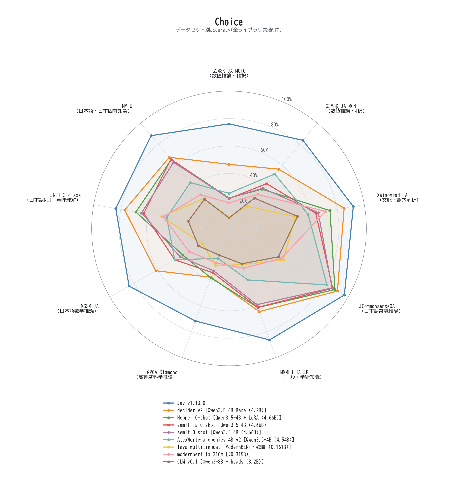
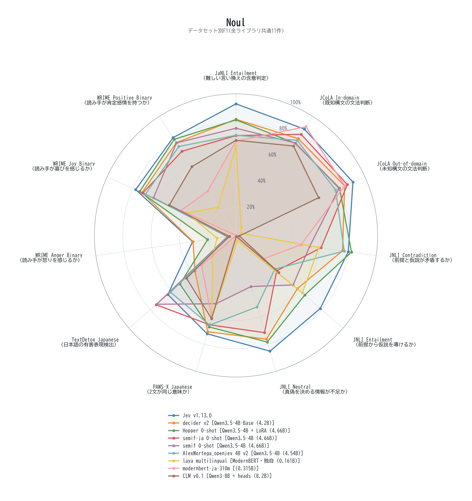

# 🧪 jev-ja-lab

日本語データセットを Jev の 3 Primitive に変換し、ローカルまたは Hugging Face Hub 上の判断モデル(ライブラリ)を
同一条件で比較する評価基盤です。文章を生成させず、「判断」だけを返させて評価します。

- `Noul`: Yes / No の二値判断
- `Choice`: 複数候補から 1 つを選択
- `Score`: 順序付き尺度のスコアリング

評価データは Hugging Face の [hachiko85/openjev-ja-eval](https://huggingface.co/datasets/hachiko85/openjev-ja-eval) に
まとめています。

## 📰 News

- **2026-09-26** 評価データセット [openjev-ja-eval](https://huggingface.co/datasets/hachiko85/openjev-ja-eval) を整備
  (11 件を収録、それ以外は配布元から取得)。HelpSteer2-JA を追加の Score 指標として追加。**decider-4b v2** と
  **Hopper** を評価対象に追加。
- **2026-09-23** Jev v1.13.0 / semif / semif-ja / laya / AlexWortega_openjev / BERT の比較評価(30 データセット、
  62,884 件)を公開。
- **2026-09-18** next-token logit 方式によるベースモデル 12 種の比較評価(`EVAL_JEV_20260918.md`)。

## 🔧 Installation

必要環境: Python 3.11 以上。GPU を使う場合は対応ドライバと CUDA 対応 PyTorch。

### Using uv

```bash
uv sync --extra eval --extra viz --extra orchestrate --extra dev
uv run pytest
```

### Using a Python virtual environment

```bash
python -m venv .venv
source .venv/bin/activate              # Windows: .venv\Scripts\Activate.ps1
pip install -e ".[eval,viz,orchestrate,dev]"
pytest
```

### Extras per library


```bash
pip install -e ".[hopper]"             # Hopper(peft)
pip install --no-deps decider-ai       # decider-4b(numpy固定を避けるため --no-deps)
pip install -e ".[laya]"               # laya
```

## 🚀 Quick Start

```bash
# 1. 評価データを取得(サブセット: noul / choice / score / all)
uv run jev-ja-lab-datasets fetch --subset all --datasets-root ./datasets

# 2. GPU不要の動作確認
uv run jev-ja-lab-eval --dataset mmmlu_ja --scorer mock --limit 5

# 3. ライブラリを指定して評価(smoke → production)
uv run jev-ja-lab-eval-workflow --config configs/eval/decider-series.yaml --phase smoke
uv run jev-ja-lab-eval-workflow --config configs/eval/decider-series.yaml --phase production
```

評価設定は `configs/eval/` にライブラリごとに用意しています(`decider-series.yaml`、`hopper-series.yaml`、
`semif-logit-series.yaml`、`openjev-series.yaml`、`laya-series.yaml`、`bert-series.yaml`、
`helpsteer-series.yaml` など)。`pip install -e ...` の環境では先頭の `uv run` を外して実行できます。
Jev API を評価する場合は `.env` に `TYPESAFE_API_KEY` / `TYPESAFE_API_URL` を設定してください。
詳細は `how_to_use.md`、Primitive の設計は `EVALUATION_PRIMITIVES.md` を参照してください。

## 📊 Evaluation

### 📚 Datasets

評価データは [hachiko85/openjev-ja-eval](https://huggingface.co/datasets/hachiko85/openjev-ja-eval) から取得できます
(サブセット `noul` / `choice` / `score` / `all`、split は `test`)。標準の評価プロファイルは 30 データセット、
1 ライブラリあたり 62,884 件です。

| Primitive | 軸数 | 件数 | データセット |
|---|---:|---:|---|
| Noul | 14 | 25,908 | JaNLI、JCoLA、JNLI、PAWS-X、TextDetox、WRIME、JAD-AFC |
| Choice | 9 | 28,676 | MMMLU、JMMLU、JGPQA、JCommonsenseQA、XWinograd、MGSM、GSM8K-JA、JNLI |
| Score | 7 | 8,300 | WRIME、Synthetic Score |
| Score(追加) | 5 | 12,500 | HelpSteer2-JA benchmark-v1(Overall には含めない) |

### 🏆 Results

判定原理が異なる 8 ライブラリを、同一のデータ・条件で比較しています(2026-09-26 時点、0-shot)。

| ライブラリ | Overall | Noul | Choice | Score | HelpSteer2 | ベースモデル | パラメータ数 | 推論時間(ms/件) |
|---|---:|---:|---:|---:|---:|---|---:|---:|
| **Jev v1.13.0** | **0.823** | 0.739 | 0.847 | 0.882 | 0.650 | TypeSafe Jev API | 非公開 | 235.12 |
| decider v2 | 0.716 | 0.637 | 0.653 | 0.857 | 0.674 | Qwen3.5-4B-Base(Mapika/decider-4b v2) | 4.2B | 70.43 |
| Hopper 0-shot | 0.684 | 0.664 | 0.551 | 0.836 | 0.616 | Qwen3.5-4B + LoRA(HopitAI/hopper) | 4.66B | 71.06 |
| semif-ja 0-shot | 0.660 | 0.604 | 0.539 | 0.837 | 0.554 | Qwen3.5-4B | 4.66B | 83.92 |
| semif 0-shot | 0.632 | 0.555 | 0.526 | 0.815 | 0.582 | Qwen3.5-4B | 4.66B | 65.87 |
| AlexWortega_openjev 4B v2 | 0.596 | 0.558 | 0.463 | 0.768 | 0.520 | Qwen3.5-4B(qwen3.5-4b-nli-v2) | 4.54B | 75.28 |
| laya multilingual | 0.450 | 0.339 | 0.313 | 0.698 | 0.607 | ModernBERT・独自 | 0.161B | 18.32 |
| modernbert-ja-310m | 0.444 | 0.432 | 0.376 | 0.523 | 0.503 | (直接評価) | 0.315B | 2.38 |

Overall は Noul(F1)・Choice(accuracy)・Score(正規化 QWK)の等加重平均です。HelpSteer2 は追加の Score 指標
(5 軸の正規化 QWK 平均、0.5 が一致なし水準)で、Overall には含めません。Hopper の推論時間は GPU 単独で測り直した値、
Jev は API のためネットワーク往復を含みます。2-shot 版(semif・decider)は評価を続行中で、この比較には含めていません。
全生データとデータセット別の内訳は `results/eval-summary/README.md` にあります。

<p align="center">
  
</p>

<p align="center">
  
</p>

<p align="center">
  
  
  
</p>

### 💡 Key Findings

- **Jev(v1.13.0)が全ライブラリ中トップ**(0.823)。外部 API のためパラメータ数は非公開で、推論時間も最長です。
- **decider-4b v2 がローカル実行で最良**(0.716)。同じ Qwen3.5-4B 系の Hopper(0.684)、semif-ja(0.660)より高く、
  Choice で特に差がつきます。追加指標の HelpSteer2 では Jev(0.650)も上回りました(0.674)。
- **日本語の自然文プロンプトが、chat テンプレート + JSON 構造化より良い**(同一モデル・0-shot で semif-ja 0.660 vs
  semif 0.632)。

再現性: `seed`、モデルの revision、データセットの revision、dtype、batch size を固定してください。`resume: true`
は既存の `summary.json` を再利用するので、条件を変えた評価は別の `run_name` を使ってください。API キーや Hub token
は YAML に書かず、環境変数で渡してください。

## 🎓 Training

Coming soon.(学習機能は現在整備中です。現フェーズは評価基盤です。)

## 📄 License

- **コード**: MIT。
- **データセット**: [openjev-ja-eval](https://huggingface.co/datasets/hachiko85/openjev-ja-eval) は、収録した 11 件(MIT・
  Apache-2.0・CC BY・CC BY-SA 4.0)を集合物として **CC BY-SA 4.0** で配布しています。各データセットの元のライセンスと
  表示義務は維持されます。収録していない JMMLU・WRIME(CC BY-NC-ND 4.0)、PAWS-X、TextDetox(OpenRAIL++)、JGPQA(要承認)は、
  取得時に配布元から直接ダウンロードされ、各配布元のライセンスが適用されます(NC-ND のデータは商用利用も改変物の再配布も
  できません)。詳細は `datasets_router/README.md` を参照してください。
- **評価対象のモデル・ライブラリ**: 各配布元のライセンスに従ってください。特に HopitAI/hopper のアダプタ重みは
  研究・デモ用途のみです。

ライセンス表記は各配布元の記載に基づく整理で、法的助言ではありません。再配布・商用利用の前に、原文を確認してください。

## 📎 Others

### Citation

```bibtex
@misc{jev-ja-lab,
  author = {hachiko85},
  title  = {jev-ja-lab: Japanese decision-model evaluation harness},
  year   = {2026},
  url    = {https://github.com/hachiko85/jev-ja-lab}
}
```

### Evaluated Libraries and Models

- decider-4b: <https://huggingface.co/Mapika/decider-4b> / <https://github.com/Mapika/decider>
- Hopper: <https://huggingface.co/HopitAI/hopper>
- semif: <https://github.com/TheoLeeCJ/SemIf>
- AlexWortega/openjev: <https://huggingface.co/AlexWortega/openjev>
- laya: <https://pypi.org/project/laya/>
- modernbert-ja-310m: <https://huggingface.co/sbintuitions/modernbert-ja-310m>

データセットの出典・引用先は [openjev-ja-eval](https://huggingface.co/datasets/hachiko85/openjev-ja-eval) の
Citation Information を参照してください。
