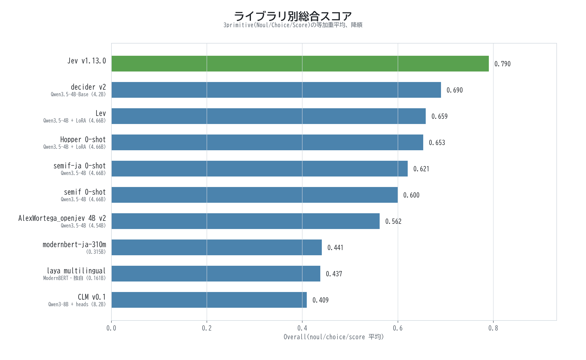
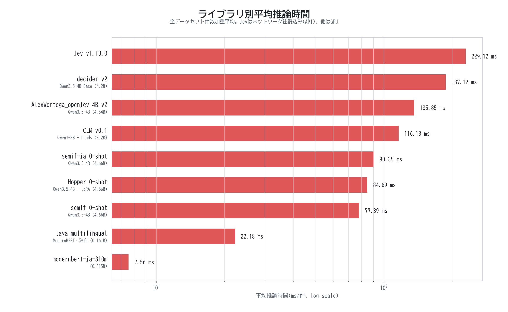
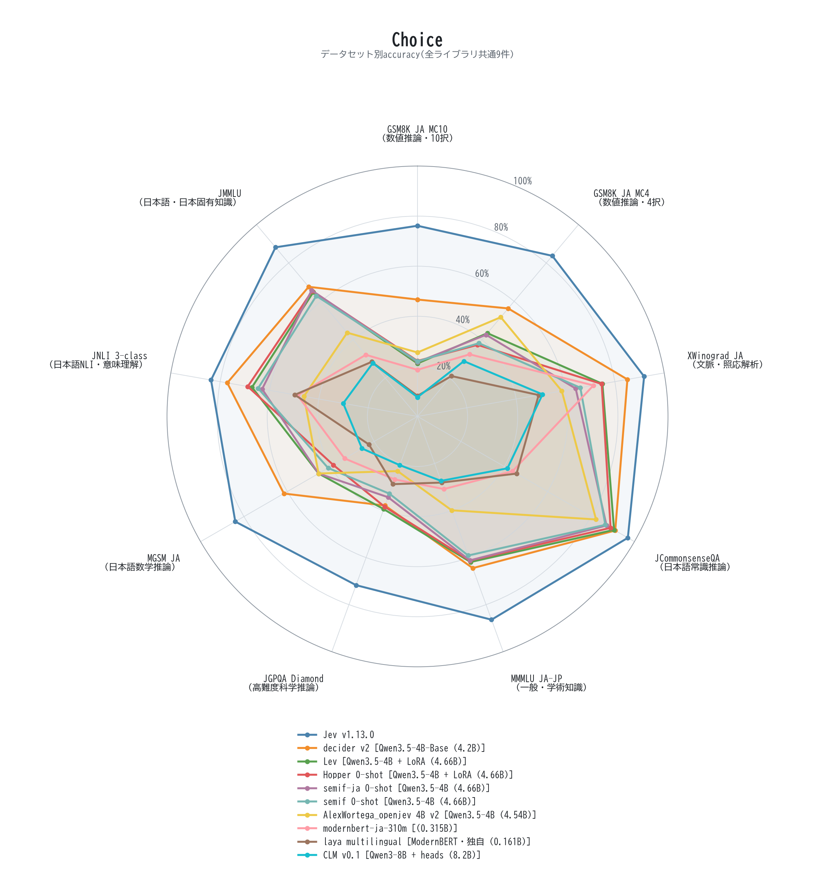
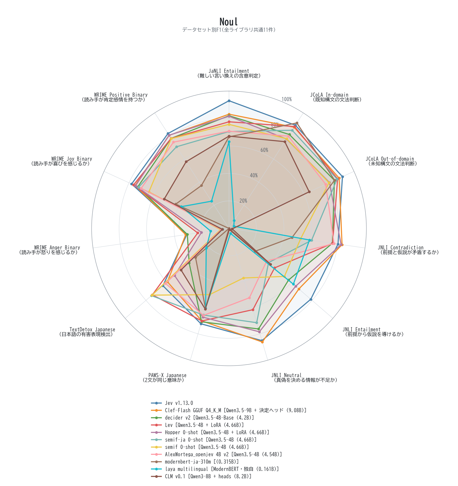
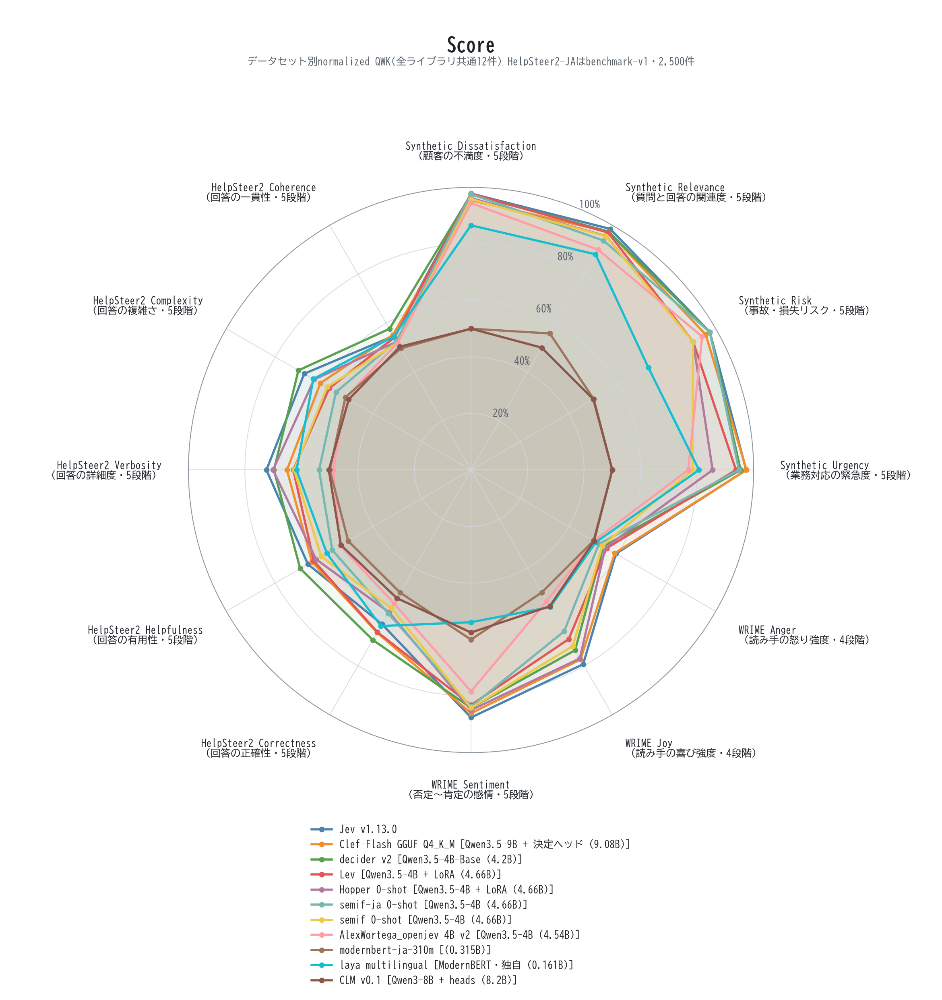

# 🧪 jev-ja-lab

日本語データセットを Jev の 3 Primitive に変換し、ローカルまたは Hugging Face Hub 上の判断モデル(ライブラリ)を
同一条件で比較する評価基盤です。文章を生成させず、「判断」だけを返させて評価します。

- `Noul`: Yes / No の二値判断
- `Choice`: 複数候補から 1 つを選択
- `Score`: 順序付き尺度のスコアリング

評価データは Hugging Face の [hachiko85/openjev-ja-eval](https://huggingface.co/datasets/hachiko85/openjev-ja-eval) に
まとめています。

## 📰 News

- **2026-10-06** **Clef-Flash**(Cloudflare/clef-flash)の GGUF(Q4_K_M、ggml-org 変換)を評価対象に追加。llama.cpp の
  `llama-server`(`/v1/systemone`)経由で実行。
- **2026-09-27** **Lev**(interfaze-ai/lev)を評価対象に追加。
- **2026-09-27** HelpSteer2-JA を Score に統合(Score 12 データセット、標準プロファイルは 35 データセット・75,384 件)。**CLM v0.1**(Contrastive-LM/CLM-v0.1-8B)を評価対象に追加。
- **2026-09-26** 評価データセット [openjev-ja-eval](https://huggingface.co/datasets/hachiko85/openjev-ja-eval) を整備
  (11 件を収録、それ以外は配布元から取得)。HelpSteer2-JA を追加の Score 指標として追加。**decider-4b v2** と
  **Hopper** を評価対象に追加。
- **2026-09-23** Jev v1.13.0 / semif / semif-ja / laya / AlexWortega_openjev / BERT の比較評価(30 データセット、
  62,884 件)を公開。
- **2026-09-18** next-token logit 方式によるベースモデル 12 種の比較評価(`EVAL_JEV_20260918.md`)。

## 🔧 Installation

必要環境: Python 3.11 以上。GPU を使う場合は対応ドライバと CUDA 対応 PyTorch。

### Using uv

```bash
uv sync --extra semif --extra dev       # 使うライブラリだけを指定
uv run pytest
```

### Using a Python virtual environment

```bash
python -m venv .venv
source .venv/bin/activate              # Windows: .venv\Scripts\Activate.ps1
pip install -e ".[semif,dev]"          # 使うライブラリだけを指定
pytest
```

### Extras per library

評価したいライブラリの名前を extra に指定すると、そのライブラリの評価に必要な依存関係だけが入ります
(例: `pip install "jev-ja-lab[semif]"`、`uv sync --extra bert`)。複数指定もできます(`[semif,bert]`)。

| Extra | ライブラリ | 追加で入るもの |
|---|---|---|
| `jev` | TypeSafe Jev API | httpx(ローカルモデル用の torch は入りません) |
| `semif` | semif | torch、transformers など |
| `semif-ja` | semif-ja | torch、transformers など |
| `bert` | BERT 系(masked LM 直接評価) | torch、transformers など |
| `embedding` | 文埋め込み + 学習済みヘッド | torch、transformers など |
| `openjev` | AlexWortega/openjev | torch、transformers など |
| `clm` | Contrastive-LM/CLM | torch、transformers など |
| `lev` | interfaze-ai/lev | 上記 + peft、公式 `lev` パッケージ(Python 3.12 以上) |
| `clef` | Cloudflare/clef-flash(HF 版は bitsandbytes 8bit、GGUF 版は llama.cpp) | bitsandbytes + torchvision(HF 版)。GGUF 版は llama.cpp b11430 以降の `llama-server`(CUDA ビルド)を `models/llama.cpp/` に別途配置 |
| `jeff` | firelex/jeff(Qwen3.5-0.8B/2B、Gemma4-E2B) | 公式 `jeff` パッケージ(`--no-deps`で別途導入 + torchvision)。フルウェイト、LoRA不要 |
| `bekko-system-one` | hotchpotch/bekko-system-one-v0-400m | `sentence-transformers`+`scikit-learn`を`--no-deps`で別途導入。custom_code(trust_remote_code)をHubから読み込み |
| `hopper` | HopitAI/hopper | 上記 + peft |
| `decider` | Mapika/decider-4b | 上記 + `pip install --no-deps decider-ai`(numpy 固定を避けるため別途) |
| `laya` / `laya-bert` | laya | 上記 + laya |
| `jevlike` | jevlike | 上記 + jevlike(GitHub) |
| `all` | 上記すべて | (`decider-ai` の手順は別途) |

各 extra には共通の実行環境(評価用の依存関係と YAML ランナー)が含まれます。GPU を使う場合は CUDA 対応の
PyTorch が入ることを確認してください。新しいライブラリを追加するときは、同名の extra を `pyproject.toml` に
追加します(`tests/unit/test_extras.py` が対応漏れを検出します)。

## 🚀 Quick Start

```bash
# 1. 評価データを取得(サブセット: noul / choice / score / all)
uv run jev-ja-lab-datasets fetch --subset all --datasets-root ./datasets

# 2. GPU不要の動作確認
uv run jev-ja-lab-eval --dataset mmmlu_ja --scorer mock --limit 5

# 3. ライブラリを指定して評価(smoke → production)
uv run jev-ja-lab-eval-workflow --config configs/eval/decider-series.yaml --phase smoke
uv run jev-ja-lab-eval-workflow --config configs/eval/decider-series.yaml --phase production
```

評価設定は `configs/eval/` にライブラリごとに用意しています(`decider-series.yaml`、`hopper-series.yaml`、
`semif-logit-series.yaml`、`openjev-series.yaml`、`laya-series.yaml`、`bert-series.yaml`、
`helpsteer-series.yaml` など)。`pip install -e ...` の環境では先頭の `uv run` を外して実行できます。
Jev API を評価する場合は `.env` に `TYPESAFE_API_KEY` / `TYPESAFE_API_URL` を設定してください。
詳細は `how_to_use.md`、Primitive の設計は `EVALUATION_PRIMITIVES.md` を参照してください。

## 📊 Evaluation

### 📚 Datasets

評価データは [hachiko85/openjev-ja-eval](https://huggingface.co/datasets/hachiko85/openjev-ja-eval) から取得できます
(サブセット `noul` / `choice` / `score` / `all`、split は `test`)。標準の評価プロファイルは 35 データセット、
1 ライブラリあたり 75,384 件です。

| Primitive | 軸数 | 件数 | データセット |
|---|---:|---:|---|
| Noul | 14 | 25,908 | JaNLI、JCoLA、JNLI、PAWS-X、TextDetox、WRIME、JAD-AFC |
| Choice | 9 | 28,676 | MMMLU、JMMLU、JGPQA、JCommonsenseQA、XWinograd、MGSM、GSM8K-JA、JNLI |
| Score | 12 | 20,800 | WRIME、Synthetic Score、HelpSteer2-JA(5 軸、benchmark-v1) |

### 🏆 Results

判定原理が異なる 11 ライブラリを、同一のデータ・条件で比較しています(2026-10-06 時点、0-shot)。

| ライブラリ | Overall | Noul | Choice | Score | ベースモデル | パラメータ数 | 推論時間(ms/件) |
|---|---:|---:|---:|---:|---|---:|---:|
| **Jev v1.13.0** | **0.790** | 0.739 | 0.847 | 0.785 | TypeSafe Jev API | 非公開 | 229.12 |
| Clef-Flash GGUF Q4_K_M | 0.729 | 0.669 | 0.749 | 0.768 | Qwen3.5-9B + 決定ヘッド(Cloudflare/clef-flash、GGUF Q4_K_M) | 9.08B | 62.16 |
| decider v2 | 0.690 | 0.637 | 0.653 | 0.781 | Qwen3.5-4B-Base(Mapika/decider-4b v2) | 4.2B | 187.12 |
| Lev | 0.659 | 0.667 | 0.565 | 0.744 | Qwen3.5-4B + LoRA(interfaze-ai/lev) | 4.66B | 119.94 |
| Hopper 0-shot | 0.653 | 0.664 | 0.551 | 0.744 | Qwen3.5-4B + LoRA(HopitAI/hopper) | 4.66B | 84.69 |
| semif-ja 0-shot | 0.621 | 0.604 | 0.539 | 0.719 | Qwen3.5-4B | 4.66B | 90.35 |
| semif 0-shot | 0.600 | 0.555 | 0.526 | 0.718 | Qwen3.5-4B | 4.66B | 77.89 |
| AlexWortega_openjev 4B v2 | 0.562 | 0.558 | 0.463 | 0.665 | Qwen3.5-4B(qwen3.5-4b-nli-v2) | 4.54B | 135.85 |
| modernbert-ja-310m | 0.441 | 0.432 | 0.376 | 0.515 | (直接評価) | 0.315B | 7.56 |
| laya multilingual | 0.437 | 0.339 | 0.313 | 0.660 | ModernBERT・独自 | 0.161B | 22.18 |
| CLM v0.1 | 0.409 | 0.423 | 0.289 | 0.516 | Qwen3-8B + 射影ヘッド(Contrastive-LM/CLM-v0.1-8B) | 8.2B | 116.13 |

Overall は Noul(F1)・Choice(accuracy)・Score(正規化 QWK)の等加重平均です。Score は WRIME・Synthetic Score・HelpSteer2-JA(5 軸、
benchmark-v1 の 2,500 件)を合わせた 12 データセットの平均です。推論時間は 35 データセットの件数加重平均で、Hopper は GPU 単独で
測り直した値、Jev は API のためネットワーク往復を含みます。2-shot 版(semif・decider)は評価を続行中で、この比較には含めていません。
全生データとデータセット別の内訳は `results/eval-summary/README.md` にあります。

<p align="center">
  
</p>

<p align="center">
  
</p>

<p align="center">
  
  
  
</p>

### 💡 Key Findings

- **Jev(v1.13.0)が全ライブラリ中トップ**(0.790)。外部 API のためパラメータ数は非公開で、推論時間も最長です。
- **Clef-Flash(GGUF Q4_K_M)がローカル実行で最良**(0.729、2 位)。4bit 量子化でも HF 版 8bit(0.727)と差がなく、
  llama.cpp 経由で約 62ms/件と、HF 版(約 213ms/件)の約 3.4 倍速です。特に Choice(0.749)が強い。
- **decider-4b v2 は 3 位**(0.690)。同じ Qwen3.5-4B 系の Hopper(0.653)、semif-ja(0.621)より高く、
  Choice で特に差がつきます。
- **Lev(Qwen3.5-4B + LoRA)は英語学習ながら日本語でも実用的**(Overall 0.659、4 位)。同じ Qwen3.5-4B 系の Hopper
  (0.653)を上回り、decider には届きません。推論時間は約 120ms/件です。
- **CLM v0.1 は日本語では機能しなかった**(Overall 0.409、Score は 0.5 前後で判別できていない)。英語で学習されたモデルで、
  Choice も accuracy 0.29 と低い。推論時間は約 89ms/件。
- **日本語の自然文プロンプトが、chat テンプレート + JSON 構造化より良い**(同一モデル・0-shot で semif-ja 0.621 vs
  semif 0.600)。

再現性: `seed`、モデルの revision、データセットの revision、dtype、batch size を固定してください。`resume: true`
は既存の `summary.json` を再利用するので、条件を変えた評価は別の `run_name` を使ってください。API キーや Hub token
は YAML に書かず、環境変数で渡してください。

## 🎓 Training

評価と同じ考え方で、YAML 1本でライブラリ(アーキテクチャ)ごとに学習を回せます。`configs/train/*.yaml` の
`models:` で `architecture` を指定するだけで、そのライブラリ用の学習ループが選ばれます
(`openjev_ja.train.architectures` が eval 側の `scorer` 一覧に相当するレジストリ)。現在は
laya の `DecisionModel`(frozen encoder + 小さな学習ヘッド、supervised cross-entropy)のみ実装済みです。

```bash
uv run jev-ja-lab-train-workflow --config configs/train/eikos-laya-bert.yaml
```

- **データ**: `openjev_ja.train.corpus` が、外部コーパス(現在は eikos-decisions 形式の
  `{state, question_type, instructions, options, expected}` JSONL)を、評価と同じ `BenchmarkItem`
  (`question` / `options` / `gold_index`)に変換します。`lang` で言語を絞れます
  (例: `lang: Japanese`)。
- **検証**: 固定の train/val 分割ではなく k-fold 交差検証です(`openjev_ja.train.cv`)。
  `folds` 個のモデルを独立に学習し、各 fold の held-out 集合での指標(Noul は F1、Choice は
  accuracy、Score は正規化 QWK)の平均・標準偏差を `summary.json` に出します。
- **結果**: `results/train-<run_name>/<model-id>/{summary.json, fold-<k>.pt, run_summary.json}`。
- **新しいアーキテクチャの追加**: `openjev_ja/train/architectures.py` に `ArchitectureSpec`
  (build / forward_logits / trainable_parameters / state_dict の4関数)を1つ追加するだけで、
  YAML の `architecture:` から選べるようになります(評価側の scorer 追加と同じパターン)。

## 📄 License

- **コード**: MIT。
- **データセット**: [openjev-ja-eval](https://huggingface.co/datasets/hachiko85/openjev-ja-eval) は、収録した 11 件(MIT・
  Apache-2.0・CC BY・CC BY-SA 4.0)を集合物として **CC BY-SA 4.0** で配布しています。各データセットの元のライセンスと
  表示義務は維持されます。収録していない JMMLU・WRIME(CC BY-NC-ND 4.0)、PAWS-X、TextDetox(OpenRAIL++)、JGPQA(要承認)は、
  取得時に配布元から直接ダウンロードされ、各配布元のライセンスが適用されます(NC-ND のデータは商用利用も改変物の再配布も
  できません)。詳細は `datasets_router/README.md` を参照してください。
- **評価対象のモデル・ライブラリ**: 各配布元のライセンスに従ってください。特に HopitAI/hopper のアダプタ重みは
  研究・デモ用途のみです。

ライセンス表記は各配布元の記載に基づく整理で、法的助言ではありません。再配布・商用利用の前に、原文を確認してください。

## 📎 Others

### Citation

```bibtex
@misc{jev-ja-lab,
  author = {hachiko85},
  title  = {jev-ja-lab: Japanese decision-model evaluation harness},
  year   = {2026},
  url    = {https://github.com/hachiko85/jev-ja-lab}
}
```

### Evaluated Libraries and Models

- decider-4b: <https://huggingface.co/Mapika/decider-4b> / <https://github.com/Mapika/decider>
- Hopper: <https://huggingface.co/HopitAI/hopper>
- Clef-Flash: <https://huggingface.co/Cloudflare/clef-flash>(GGUF: <https://huggingface.co/ggml-org/Clef-Flash-GGUF>、実行: <https://github.com/ggml-org/llama.cpp>)
- Lev: <https://huggingface.co/interfaze-ai/lev> / <https://github.com/Abhinavexists/lev>
- Jeff: <https://github.com/firelex/jeff>(モデル: mstrasser/Jeff-Qwen3.5-0.8B, -2B, -Gemma4-E2B)
- Bekko System One: <https://huggingface.co/hotchpotch/bekko-system-one-v0-400m> / <https://github.com/hotchpotch/bekko-system-one>
- CLM: <https://huggingface.co/Contrastive-LM/CLM-v0.1-8B> / <https://github.com/Contrastive-LM/CLM>
- semif: <https://github.com/TheoLeeCJ/SemIf>
- AlexWortega/openjev: <https://huggingface.co/AlexWortega/openjev>
- laya: <https://pypi.org/project/laya/>
- modernbert-ja-310m: <https://huggingface.co/sbintuitions/modernbert-ja-310m>

データセットの出典・引用先は [openjev-ja-eval](https://huggingface.co/datasets/hachiko85/openjev-ja-eval) の
Citation Information を参照してください。
